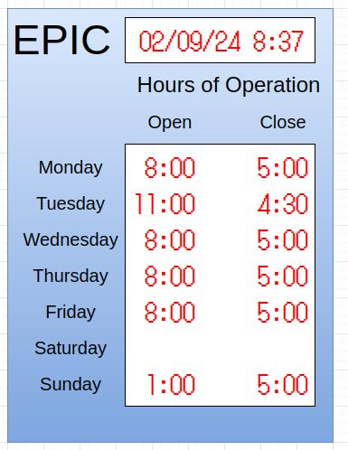

# epic-hours

This is a project to create an electronic sign to display the opening
hours in EPIC.  Basic function is simple:  display open and close time
for each day of the week.

Also, it should display the current date and time, just for fun.

For flexibility, should be able to display 4 digits:

    ten hours:   (blank) or 1
    one hours:   (blank) or 0-9
    ten minutes: (blank) or 0, 3
    one minutes: (blank) or 0

If we come up with a universal digit display (e.g. 7-segment) then
we could just use it everywhere.

A total of 28 digits plus ~10 for date/time are needed

It would be cool to have a mechanical display with electronic
controls.  Some ideas:

* 7-segment with white/black segments which toggle somehow
* flip cards like the old clocks
* rotating wheel with digits

## XY mechanism to flip segments

Here's a crazy idea:  build a big array of 7-segment digits which
require some mechanical intervention to flip the segments (pushing a
pin, magnetic activation, etc).  Then, construct a big XY mechanism
(H-bot, CoreXY or other) on the back which would (slowly) go through
and flip the segments as needed.  It would be fun to watch in action!

The hours would change rarely, but a clock/calendar display would
update once a minute and provide some action.

## Overall design

A reasonable size for the sign is 18" x 24".  Individual digits would
be around 0.85 x 1.5 inches.

### LED version

The first version should just be "boring" LEDs.  Probably LED matrix,
at least for a banner at the top so messages can be scrolled.
8x8 maxtrix are very popular, so thinking of a 5x7 font.
24 columns work for 12:34 displays.

Need a total of 42+8 = 50 of these.  This is about $100
for modules with MAX7219 included.

	
Possible drivers:

    ATTiny, ATMega with simple mux, need ~19 I/Os    $1.50 each @ 25
    ATMega8515 has 32 I/Os.  Reserve 2 for comms,
  	  leaves 30.  Could do a 14 x 16 array (4 digits). $3.50 each @ 25

LEDs:

    Thinking of 5mm round thru-hole red
    Something like $0.07 each from regular suppliers.
	Amazon has home down to $0.04 each.

Adafruit red 8x8 1.2" matrix is $3.95.  Not a bad deal.
A "12:00" type display fits in 14 columns _if_ the first
column is truncated (only blank or '1' need be displayed for hours).

Just found out you can buy 10 of these for $12.  Ordered a set
to play with.

[Preview](Sketches/amazon_8x8.jpg)
